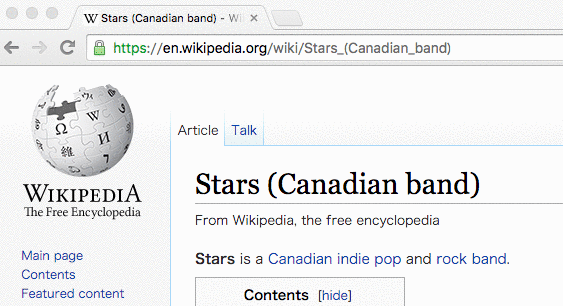

# Common-YouTube (Beta => v0.0.3)
YouTube検索を行うためのChrome拡張機能

------
###概要
YouTube検索を行うためのショートカットコマンドを提供します。

------

###セットアップ
######1 : ダウンロード => インストール 
crxファイル をこちらからダウンロードして下さい ⇒ [Releases (Beta => v0.0.2).](https://github.com/shinshin86/Common-YouTube/releases/tag/v0.0.2)  

######・拡張機能のインストール方法 
Chrome拡張機能ページ([chrome://extensions](chrome://extensions))を開き、先ほどダウンロードしたcrxファイルをドラッグ・アンド・ドロップで格納してください。

######2 : ショートカットコマンドのセットアップ 
Chrome拡張機能のショートカットコマンド設定ページ([chrome://extensions/configureCommands](chrome://extensions/configureCommands))に移動してください。

 

	右のショートカットコマンドを追加してください : Ctrl + Shift + Z
	(もちろん、あなたの任意のコマンドで追加しても構いません)
	
------
###使い方

テキストを選択した状態で、先ほど追加したショートカットコマンドを実行してください。 
選択テキストでそのままYouTube検索が行えます。

